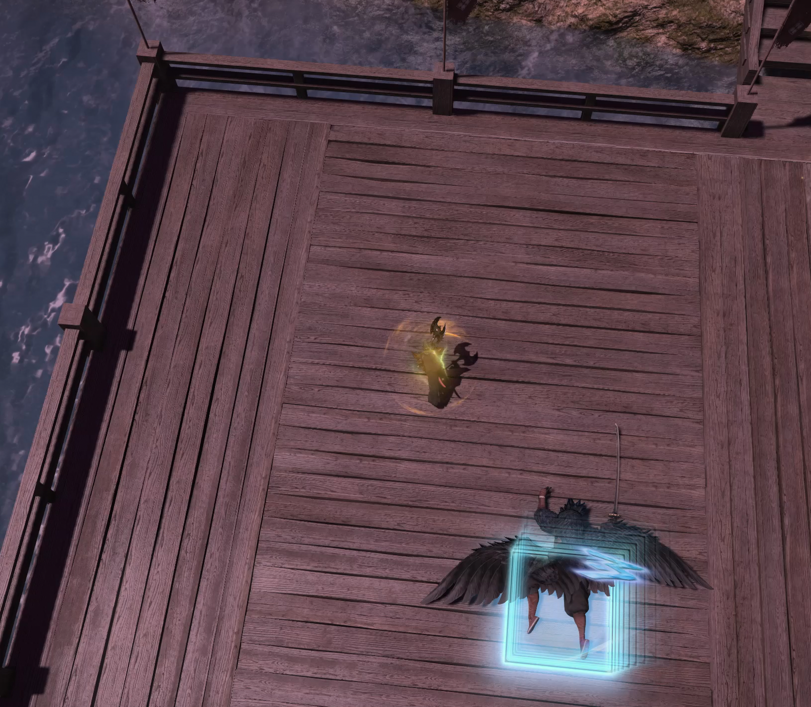

{: .markers }




These markers show where the there are relative safe spots for pulling adds.

***1*** --- South west corner \\
***2*** --- West wall, just north of the center line. \\
***3*** --- Offset from the North West Corner.

{: style="width: 20rem" }


See the guide below for when each marker becomes safe.

{: .mb-1 .fs-6 }
**Normal**

```json
{"Name":"Trash Spots","MapID":946,
"A":{"X":0.0,"Y":0.0,"Z":0.0,"ID":0,"Active":false},
"B":{"X":0.0,"Y":0.0,"Z":0.0,"ID":1,"Active":false},
"C":{"X":0.0,"Y":0.0,"Z":0.0,"ID":2,"Active":false},
"D":{"X":0.0,"Y":0.0,"Z":0.0,"ID":3,"Active":false},
"One":{"X":282.564,"Y":0.0,"Z":37.529,"ID":4,"Active":true},
"Two":{"X":282.494,"Y":0.0,"Z":-3.235,"ID":5,"Active":true},
"Three":{"X":291.782,"Y":0.0,"Z":-26.555,"ID":6,"Active":true},
"Four":{"X":0.0,"Y":0.0,"Z":0.0,"ID":7,"Active":false}}
```

{: .mb-1 .fs-6 }
**Savage**

```json
{"Name":"Trash Spots","MapID":947,
"A":{"X":0.0,"Y":0.0,"Z":0.0,"ID":0,"Active":false},
"B":{"X":0.0,"Y":0.0,"Z":0.0,"ID":1,"Active":false},
"C":{"X":0.0,"Y":0.0,"Z":0.0,"ID":2,"Active":false},
"D":{"X":0.0,"Y":0.0,"Z":0.0,"ID":3,"Active":false},
"One":{"X":282.564,"Y":0.0,"Z":37.529,"ID":4,"Active":true},
"Two":{"X":282.494,"Y":0.0,"Z":-3.235,"ID":5,"Active":true},
"Three":{"X":291.782,"Y":0.0,"Z":-26.555,"ID":6,"Active":true},
"Four":{"X":0.0,"Y":0.0,"Z":0.0,"ID":7,"Active":false}}
```

